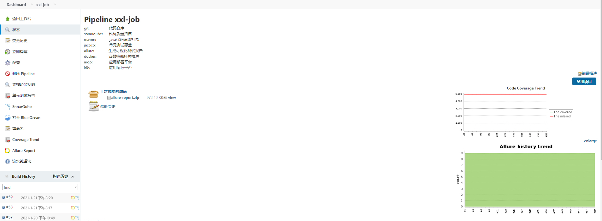
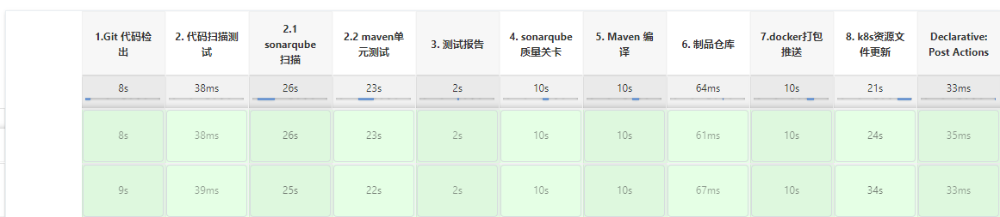
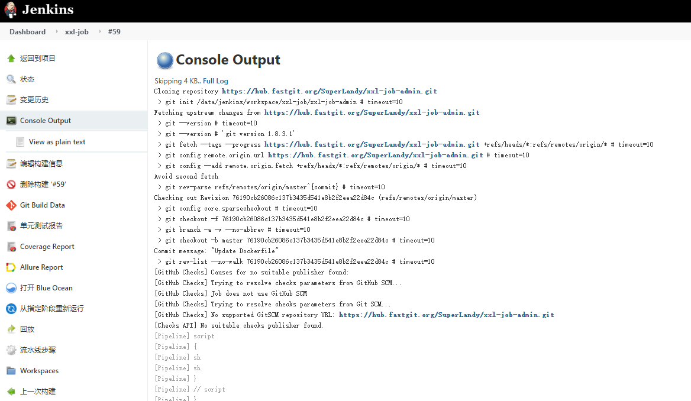
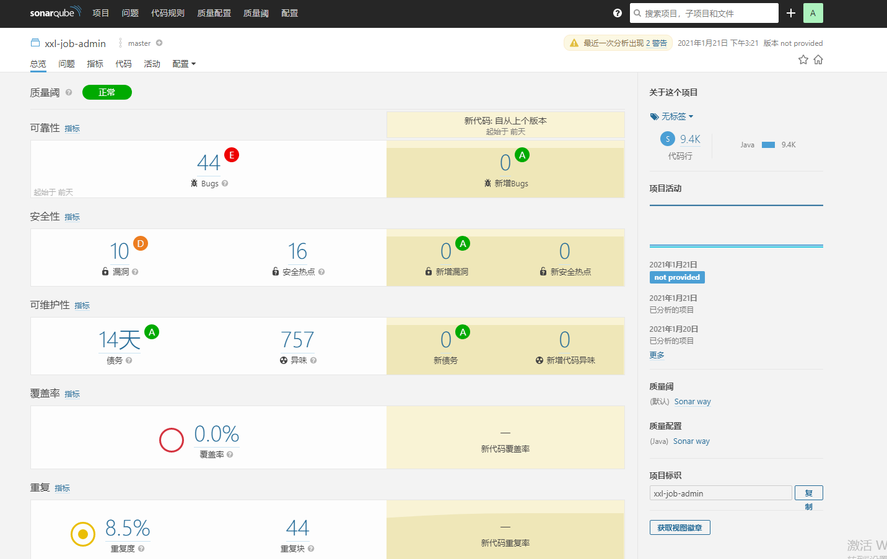
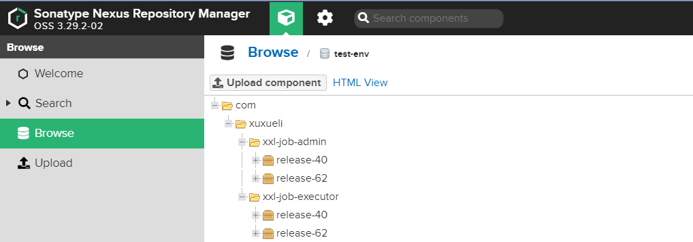
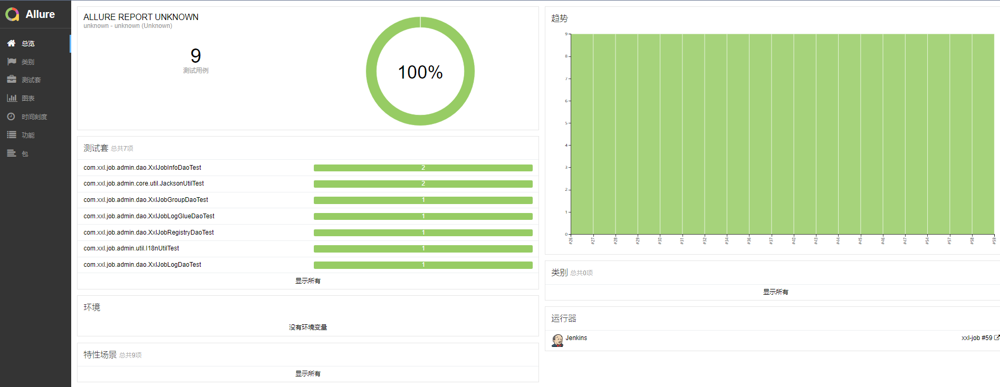
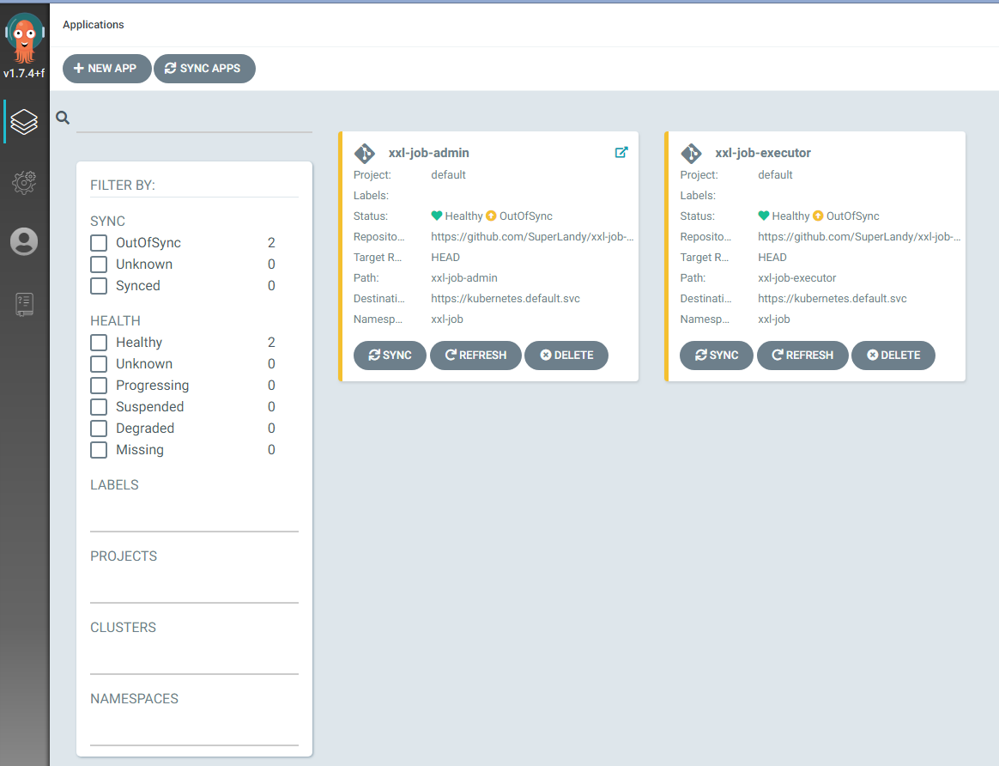
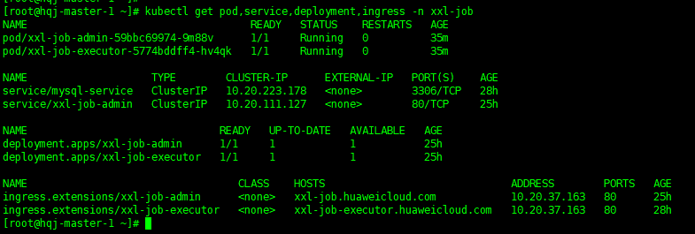
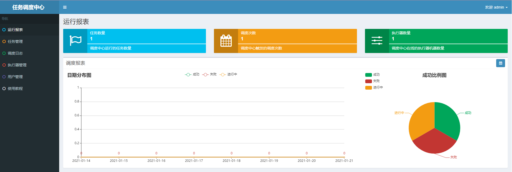
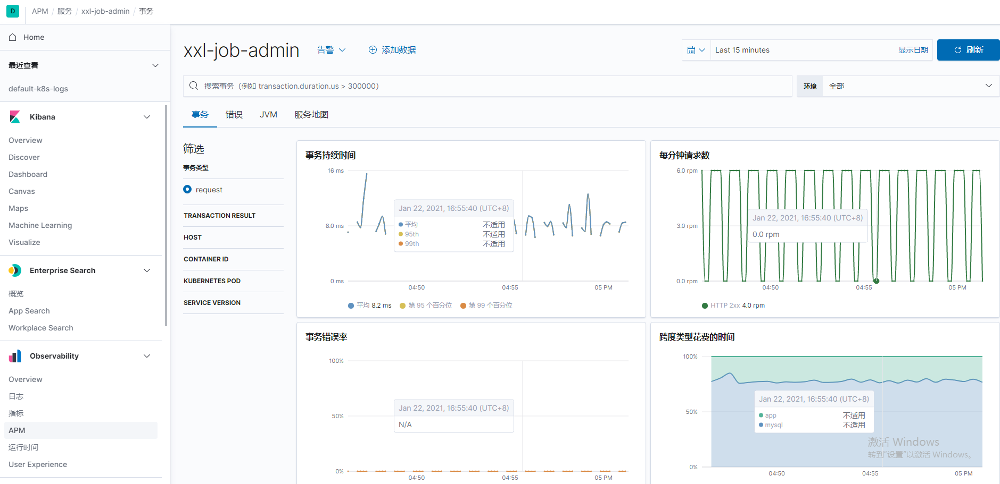

## 应用概述 

XXL-JOB 一个开源的任务调度中心

* 项目地址： https://github.com/xuxueli/xxl-job      

* 项目代码结构：
####
	xxl-job-admin                              调度中心
	xxl-job-core                               公共依赖
	xxl-job-executor-samples                   执行器Sample示例
	  xxl-job-executor-sample-springboot       Springboot版本，通过Springboot管理执行器
	  xxl-job-executor-sample-spring           Spring版本，通过Spring容器管理执行器
	  xxl-job-executor-sample-frameless        无框架版本

* Jenkins工具列表：	  
####
	Plugin： 
		git
		Text Finder
		jacoco
		Allure
		Sonar Quality Gates Plugin
		SonarQube Scanner for Jenkins
		nexus Artifact Uploader plugin
	
	linux:
		git
		sonar-scan
		allure-commandline
		

## 流水线阶段描述

* git clone：         代码克隆
* sonarqube scanner： 代码扫描（sonar与Junit同步进行）
* Junit Test：        单元测试
* Allure ：           测试结果图表
* Maven Build：       代码编译
* Nexus:              制品仓库
* Docker Build:       容器构建推送
* git tag：           携带本次修改变动信息，更新deployment仓库的yaml文件
* Deployment：        argo平台自动同步deployment仓库配置文件
* Post：              发送结果邮件

## 工具链描述

* jenkins             CI工具，部署在虚拟机中
* github              代码管理
* sonarqube           代码质量扫描
* allure              测试结果报表生成工具
* maven               java代码测试编译打包
* harbor              docker镜像仓库管理
* nexus               制成品管理
* argo                CD工具，自动同步github仓库配置文件
* MySQL               xxl-job-admin 连接数据库
* postgresql          sonarqube连接数据库
* elastic-apm         apm监控埋点
* efk                 k8s日志系统

## CI/CD 功能

* 代码质量扫描
* 单元测试
* 测试报表生成
* 代码编译打包
* images打包
* git 管理
* 应用部署
* 发送邮件

## 演示截图

* Pipeline 流水线

  

* Pipleline 阶段视图

  

* Pipeline 执行日志部分截图

  
  
  
* sonarqube 扫描截图

  
  
  
* Nexus 制品仓库截图

    
  
  
* allure 测试报告图

    
  
  
* argo 工作台

   
  

* 应用部署结果截图

  
  
  
* 应用截图

    
  
* apm效果
      